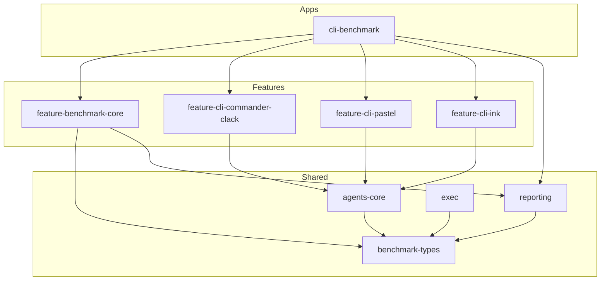

# Arquitetura do Monorepo trying-cli

Documentação da estrutura, dependências e convenções do monorepo **trying-cli** — benchmark de três implementações de CLI para instalação de skills e hooks de agentes AI.

---

## 1. Visão geral

O projeto é um monorepo **Nx + pnpm workspaces** que compara três stacks de CLI (Commander+Clack, Ink, Pastel) sobre um domínio compartilhado (`agents-core`). Um app de benchmark (`cli-benchmark`) orquestra os adapters e gera relatórios comparativos.

**Stack principal:**

- **Monorepo:** Nx 20.8.1 + pnpm 9.15.9
- **Runtime:** Node.js 22, TypeScript 5.8.2
- **Execução dev:** tsx (sem bundle para CLIs)
- **Testes:** Vitest 3.0.9
- **Lint:** ESLint 9 + @nx/eslint-plugin (module boundaries)

---

## 2. Estrutura de pastas

```
trying-cli/
├── apps/
│   └── cli-benchmark/
│       ├── package.json
│       ├── project.json
│       ├── tsconfig.json
│       ├── tsconfig.app.json
│       └── src/
│           ├── main.ts          ← entry do benchmark
│           ├── registry.ts      ← compõe os 3 adapters de CLI
│           └── index.ts
│
├── packages/
│   ├── feature-cli-commander-clack/   ← implementação 1: Commander + Clack
│   │   ├── package.json
│   │   ├── project.json
│   │   ├── README.md
│   │   └── src/
│   │       ├── bin.ts           ← entry point CLI
│   │       ├── program.ts       ← Commander program
│   │       ├── index.ts         ← public API (createCliAdapter)
│   │       ├── domain/constants.ts
│   │       ├── flows/           ← wizard interativo (Clack)
│   │       └── hooks/
│   │           └── use-benchmark-adapter/
│   │
│   ├── feature-cli-pastel/            ← implementação 2: Pastel (file-based + Ink)
│   │   ├── package.json
│   │   ├── project.json
│   │   ├── README.md
│   │   ├── source/
│   │   │   ├── cli.tsx          ← entry point CLI
│   │   │   ├── commands/index.tsx
│   │   │   └── app/             ← PastelApp, componentes Ink
│   │   └── src/
│   │       ├── index.ts
│   │       ├── domain/constants.ts
│   │       └── hooks/
│   │           └── use-benchmark-adapter/
│   │
│   ├── feature-cli-ink/               ← implementação 3: Ink puro
│   │   ├── package.json
│   │   ├── project.json
│   │   ├── README.md
│   │   └── src/
│   │       ├── bin.ts           ← entry point CLI
│   │       ├── main.tsx         ← runInkUi()
│   │       ├── index.ts
│   │       ├── app/App.tsx + components/
│   │       ├── domain/constants.ts
│   │       └── hooks/
│   │           └── use-benchmark-adapter/
│   │
│   ├── feature-benchmark-core/
│   │   ├── package.json
│   │   ├── project.json
│   │   ├── vite.config.ts
│   │   ├── README.md
│   │   └── src/hooks/use-benchmark-suite/
│   │
│   └── shared/
│       ├── agents-core/               ← domínio: install, catalog, workspace
│       │   ├── assets/skills/, assets/hooks/
│       │   ├── vite.config.ts
│       │   └── src/
│       │       ├── domain/            ← types, catalogs, flow-steps
│       │       └── hooks/             ← use-install, use-workspace, etc.
│       ├── benchmark-types/           ← tipos compartilhados (AdapterId, etc.)
│       ├── exec/                      ← utilitários de execução de processos
│       └── reporting/                 ← formatação de relatórios de benchmark
│
├── tools/
│   └── scripts/
│       ├── validate-cli-smoke.ts      ← smoke test não-interativo
│       └── seed-fixtures.ts
│
├── docs/                              ← documentação
│   ├── agentes.md
│   ├── guia-cli.md
│   ├── instalacao-projeto.md
│   ├── instalacao-global.md
│   ├── vercel-labs-skills.md
│   ├── architecture.md                ← este arquivo
│   ├── como-funciona.md
│   ├── comparativo-frameworks.md
│   └── distribuicao.md
│
├── .github/
│   ├── CODEOWNERS
│   └── workflows/ci.yml
│
├── .agents/                           ← specs e skills (gitignored)
│   ├── specs/agents-cli/, benchmark-suite/
│   └── skills/monorepo/, react-feature-sliced-design/
│
├── package.json                       ← scripts raiz (cli, benchmark, lint, test)
├── pnpm-workspace.yaml
├── nx.json
├── tsconfig.base.json
├── tsconfig.json
├── eslint.config.js
└── vitest.workspace.ts
```

---

## 3. Diagrama de dependências



### Regras de dependência (Nx module boundaries)

| Tag de origem | Pode depender de |
|---------------|------------------|
| `type:api` | `type:feature`, `type:shared` |
| `type:feature` | `type:shared` |
| `type:shared` | `type:shared` |
| `scope:feature` | `scope:shared` |
| `scope:shared` | `scope:shared` |

**Princípio:** features de CLI não dependem umas das outras. A composição acontece apenas na camada `apps/cli-benchmark` via `registry.ts`.

---

## 4. Pacotes e responsabilidades

### Apps

| Pacote | Tipo | Responsabilidade |
|--------|------|------------------|
| `cli-benchmark` | `type:api`, `scope:host` | Orquestra benchmark, compõe adapters, gera relatórios JSON/Markdown |

### Features

| Pacote | Framework | Bin | Responsabilidade |
|--------|-----------|-----|------------------|
| `feature-cli-commander-clack` | Commander + Clack | `agents-clack` | Wizard interativo com prompts Clack |
| `feature-cli-pastel` | Pastel + Ink | `agents-pastel` | CLI com file-based routing sobre Ink |
| `feature-cli-ink` | Ink puro | `agents-ink` | UI React no terminal |
| `feature-benchmark-core` | — | — | `runSuite()`, `DEFAULT_SCENARIOS` |

### Shared

| Pacote | Responsabilidade |
|--------|------------------|
| `agents-core` | Domínio: catálogo de agentes/skills/hooks, instalação, workspace picker, path guard |
| `benchmark-types` | Tipos: `CliAdapter`, `CliAdapterId`, `BenchmarkScenario`, `RunResult` |
| `exec` | Utilitários de execução de processos |
| `reporting` | `toJson()`, `toMarkdown()` para relatórios de benchmark |

---

## 5. Path aliases (`tsconfig.base.json`)

| Alias | Caminho |
|-------|---------|
| `@trying-cli/benchmark-types` | `packages/shared/benchmark-types/src/index.ts` |
| `@trying-cli/exec` | `packages/shared/exec/src/index.ts` |
| `@trying-cli/agents-core` | `packages/shared/agents-core/src/index.ts` |
| `@trying-cli/reporting` | `packages/shared/reporting/src/index.ts` |
| `@trying-cli/feature-benchmark-core` | `packages/feature-benchmark-core/src/index.ts` |
| `@trying-cli/feature-cli-pastel` | `packages/feature-cli-pastel/src/index.ts` |
| `@trying-cli/feature-cli-commander-clack` | `packages/feature-cli-commander-clack/src/index.ts` |
| `@trying-cli/feature-cli-ink` | `packages/feature-cli-ink/src/index.ts` |

---

## 6. Convenções de nomenclatura

### Pacotes

- `feature-cli-*` — implementações de CLI (cada uma com stack diferente)
- `feature-benchmark-core` — lógica de benchmark
- `shared/*` — domínio e utilitários compartilhados

### Tags Nx (`project.json`)

| Tag | Significado |
|-----|-------------|
| `type:api` | Aplicação host (cli-benchmark) |
| `type:feature` | Feature de CLI ou benchmark |
| `type:shared` | Biblioteca compartilhada |
| `scope:host` | App orquestrador |
| `scope:feature` | Feature isolada |
| `scope:shared` | Shared lib |
| `domain:cli-*` | Domínio específico da feature CLI |
| `domain:benchmark` | Domínio do benchmark |

### Estrutura interna das features CLI

Cada feature CLI segue o padrão:

```
src/
├── bin.ts ou source/cli.tsx   ← entry point
├── index.ts                   ← public API (createCliAdapter, run)
├── domain/constants.ts        ← ADAPTER_ID, ADAPTER_LABEL
├── flows/ ou app/             ← UI específica do framework
└── hooks/
    └── use-benchmark-adapter/ ← adapter para o benchmark
```

O domínio de negócio (instalação, catálogo, workspace) **nunca** fica nas features — fica em `agents-core`.

---

## 7. Scripts raiz

| Script | Comando | Descrição |
|--------|---------|-----------|
| `cli` / `cli:clack` | `tsx packages/feature-cli-commander-clack/src/bin.ts` | CLI Commander+Clack |
| `cli:pastel` | `tsx packages/feature-cli-pastel/source/cli.tsx` | CLI Pastel |
| `cli:ink` | `tsx packages/feature-cli-ink/src/bin.ts` | CLI Ink |
| `benchmark` | `nx run cli-benchmark:benchmark` | Benchmark completo |
| `benchmark:dry` | `nx run cli-benchmark:benchmark:dry` | Benchmark dry-run |
| `lint` | `nx run-many -t lint` | Lint em todos os pacotes |
| `test` | `vitest run` | Testes |
| `validate:cli-smoke` | `tsx tools/scripts/validate-cli-smoke.ts` | Smoke test |
| `build` | `nx run-many -t build` | Build (apenas cli-benchmark hoje) |

---

## 8. CI/CD

O workflow `.github/workflows/ci.yml` executa em push/PR para `main`/`master`:

1. `pnpm install --frozen-lockfile`
2. `nx affected -t lint`
3. `nx affected -t test`
4. `nx run cli-benchmark:benchmark:dry`

Não há publicação npm — todos os pacotes são `private: true`.

---

## 9. Comparação com vercel-labs/skills

| Aspecto | trying-cli | vercel-labs/skills |
|---------|------------|-------------------|
| Estrutura | Nx monorepo (8+ pacotes) | Pacote único |
| Domínio | `agents-core` (shared lib) | Tudo em `src/` |
| CLIs | 3 implementações em benchmark | 1 implementação em produção |
| Distribuição | Local (`pnpm run cli`) | npm (`npx skills`) |
| Build | tsx (dev), tsc (benchmark app) | obuild (bundle para npm) |

Para análise detalhada da CLI da Vercel, veja [vercel-labs-skills.md](./vercel-labs-skills.md).
