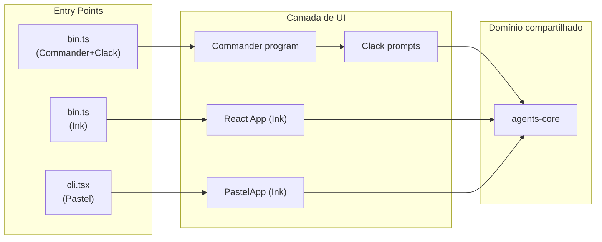
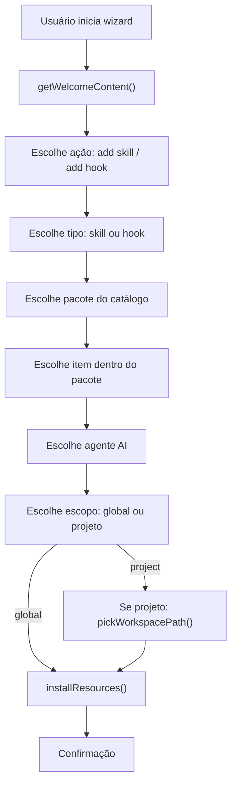
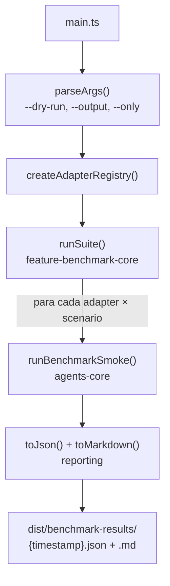

# Como funciona o trying-cli

Fluxo de execução das três implementações de CLI, consumo do `agents-core` e orquestração do benchmark.

---

## 1. Visão geral do fluxo

Todas as implementações CLI compartilham o mesmo domínio de negócio via `@trying-cli/agents-core`. A diferença está apenas na camada de apresentação (prompts, componentes, routing).



---

## 2. agents-core — domínio compartilhado

O pacote `packages/shared/agents-core` contém toda a lógica de negócio. Nenhuma feature CLI implementa instalação ou catálogo por conta própria.

### Módulos principais

| Módulo | Export | Responsabilidade |
|--------|--------|------------------|
| `domain/agent-catalog` | `AGENT_CATALOG`, `buildAgentPickOptions` | Catálogo de agentes AI suportados |
| `domain/skill-catalog` | `getSkillPackages`, `findSkillPackage` | Catálogo de skills disponíveis |
| `domain/hook-catalog` | `getHookPackages`, `findHookPackage` | Catálogo de hooks disponíveis |
| `domain/flow-steps` | `ADD_FLOW_ORDER`, `getFlowStep` | Ordem e metadados dos passos do wizard |
| `hooks/use-install` | `installResources`, `installAgentResource` | Instalação de skills/hooks (global ou projeto) |
| `hooks/use-workspace` | `detectProjectRoot`, `listProjects` | Detecção e validação de workspace |
| `hooks/use-workspace-picker` | `browseWorkspace`, `pickWorkspacePath` | Navegação de diretórios para escolha de projeto |
| `hooks/use-path-guard` | `validateInstallTarget`, `assertDirectoryExists` | Validação de paths de instalação |
| `hooks/use-benchmark-smoke` | `runBenchmarkSmoke` | Smoke test usado pelo benchmark |

### Fluxo de instalação (domínio)



---

## 3. Commander + Clack (`feature-cli-commander-clack`)

### Entry point

```typescript
// packages/feature-cli-commander-clack/src/bin.ts
#!/usr/bin/env node
import { createProgram } from './program.js';
await createProgram().parseAsync(process.argv);
```

### Routing (Commander)

```typescript
// packages/feature-cli-commander-clack/src/program.ts
const program = new Command('agents-clack')
  .description('Agents CLI — Commander.js + Clack')
  .version('1.0.0');

program.command('start').action(async () => {
  await runInteractiveFlow();
});

program.action(async () => {
  await runInteractiveFlow();  // default quando sem subcomando
});
```

### Fluxo interativo (Clack)

O arquivo `flows/run-interactive.ts` implementa o wizard completo:

1. **Welcome** — `showWelcomeScreen()` com banner ASCII
2. **Ação principal** — `p.select()` para escolher add skill/hook
3. **Catálogo** — `p.select()` com pacotes de `getSkillPackages()` / `getHookPackages()`
4. **Item** — seleção do item dentro do pacote
5. **Agente** — `p.select()` com `buildAgentPickOptions()`
6. **Escopo** — global ou projeto
7. **Workspace** — `browseFolderClack()` (navegação de pastas com `p.select()`)
8. **Instalação** — `installResources()` do agents-core
9. **Confirmação** — `p.outro()` com resumo

Cada passo usa `@clack/prompts` (`p.select`, `p.confirm`, `p.cancel`) e `picocolors` para formatação.

### Execução

```bash
pnpm run cli          # ou cli:clack
pnpm exec agents-clack
nx run feature-cli-commander-clack:run
```

---

## 4. Ink puro (`feature-cli-ink`)

### Entry point

```typescript
// packages/feature-cli-ink/src/main.tsx
export function runInkUi(): void {
  if (!process.stdin.isTTY) {
    console.log('Agents CLI requer um terminal interativo (TTY).');
    process.exit(1);
  }
  render(<App />);
}
```

### Fluxo (React no terminal)

O componente `App.tsx` gerencia o wizard como uma máquina de estados React:

1. **Welcome** — componente `<Welcome />` com gradient text
2. **Steps** — cada passo é um estado (`FlowStepId`) renderizado com `<SelectInput />` do Ink
3. **Navegação** — `useInput()` para teclas (voltar, cancelar)
4. **Workspace browser** — lista de diretórios com `<SelectInput />`
5. **Instalação** — `<Spinner />` durante `installResources()`
6. **Resumo** — componente `<StepSummary />` com respostas acumuladas

Componentes Ink usados:

- `ink-select-input` — menus de seleção
- `ink-spinner` — loading durante instalação
- `ink-big-text` + `ink-gradient` — banner de boas-vindas

### Execução

```bash
pnpm run cli:ink
pnpm exec agents-ink
nx run feature-cli-ink:run
```

---

## 5. Pastel (`feature-cli-pastel`)

### Entry point

```typescript
// packages/feature-cli-pastel/source/cli.tsx
import Pastel from 'pastel';

const app = new Pastel({
  importMeta: import.meta,
  name: 'agents-pastel',
  version: '1.0.0',
});

await app.run();
```

### Routing (file-based)

Pastel usa file-based routing estilo Next.js:

```
source/
├── cli.tsx              ← bootstrap do Pastel
└── commands/
    └── index.tsx        ← comando default → renderiza PastelApp
```

O comando default em `source/commands/index.tsx` renderiza `PastelApp`, que é uma implementação Ink similar à do `feature-cli-ink`, mas com:

- Validação de argumentos via **Zod**
- Routing automático pelo Pastel (sem Commander)
- Estrutura de pastas `source/commands/` para subcomandos futuros

### Execução

```bash
pnpm run cli:pastel
pnpm exec agents-pastel
nx run feature-cli-pastel:run
```

---

## 6. Benchmark (`cli-benchmark`)

### Composição dos adapters

O único lugar onde as três features CLI se encontram é `apps/cli-benchmark/src/registry.ts`:

```typescript
export function createAdapterRegistry(): CliAdapter[] {
  return [
    createPastel(),
    createCommanderClack(),
    createInk(),
  ];
}
```

Cada feature exporta `createCliAdapter()` que retorna um `CliAdapter`:

```typescript
// Exemplo: feature-cli-commander-clack
export function createCliAdapter(): CliAdapter {
  return {
    id: 'cli-commander-clack',
    label: 'Commander + Clack',
    run: (scenario, options) =>
      runBenchmarkSmoke('cli-commander-clack', scenario, options?.dryRun ?? false),
  };
}
```

### IDs dos adapters

| ID | Label | Framework |
|----|-------|-----------|
| `cli-commander-clack` | Commander + Clack | Commander + @clack/prompts |
| `cli-ink` | Ink | Ink + React |
| `cli-pastel` | Pastel | Pastel + Ink + React |

### Fluxo do benchmark



### Cenários padrão (`DEFAULT_SCENARIOS`)

| ID | Nome | O que testa |
|----|------|-------------|
| `hello-world` | Hello World | Banner e brand name do agents-core |
| `list-files` | List Files | Workspace validation + dry-run install |
| `cold-start` | Cold Start | Criação de temp dir + smoke path |

### Execução

```bash
pnpm run benchmark           # benchmark completo
pnpm run benchmark:dry       # dry-run (usado no CI)
pnpm run benchmark:tsx:dry   # via tsx direto

# Filtrar adapters
pnpm run benchmark:tsx:dry -- --only=cli-commander-clack,cli-ink

# Output customizado
pnpm run benchmark:tsx -- --output=./my-results
```

### Smoke test standalone

```bash
pnpm run validate:cli-smoke
```

Executa `tools/scripts/validate-cli-smoke.ts` — smoke não-interativo do adapter Clack + agents-core.

---

## 7. Resumo: o que cada camada faz

| Camada | Pacote | Responsabilidade |
|--------|--------|------------------|
| **Entry** | `feature-cli-*/bin.ts` ou `cli.tsx` | Bootstrap, TTY check |
| **Routing** | Commander / Pastel / Ink App | Parse de args, navegação |
| **UI** | Clack prompts / Ink components | Wizard interativo |
| **Domínio** | `agents-core` | Catálogo, instalação, workspace |
| **Benchmark** | `feature-benchmark-core` + `cli-benchmark` | Composição e medição |
| **Tipos** | `benchmark-types` | Contratos entre camadas |
| **Relatório** | `reporting` | JSON e Markdown |

A regra fundamental: **features CLI são adapters de UI**. Toda lógica de negócio vive em `agents-core`.
