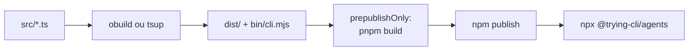

# Distribuição e Build

Estratégia de build, publicação npm e CI/CD para o trying-cli — com referência ao pipeline da vercel-labs/skills.

---

## 1. Estado atual

| Aspecto | trying-cli | vercel-labs/skills |
|---------|------------|-------------------|
| **Versão** | 0.0.0 | 1.5.10 |
| **Publicação** | Não (`private: true`) | Sim (npm) |
| **Instalação** | `pnpm run cli` (local) | `npx skills` |
| **Build** | tsx (dev), tsc (benchmark app) | obuild (bundle) |
| **Entry point** | `.ts` source direto | `bin/cli.mjs` (bundled) |
| **CI** | lint + test + benchmark:dry | lint + test + publish |

Hoje o trying-cli roda via `tsx` — TypeScript executado diretamente, sem bundle. Isso funciona para desenvolvimento e benchmark, mas não é adequado para distribuição via `npx`.

---

## 2. Opções de bundler

### obuild (usado pela vercel-labs/skills)

- **O que é:** zero-config ESM/TS builder da unjs, baseado em Rolldown (Rust) + OXC
- **Prós:** bundle mínimo, rápido, usado em produção pela Vercel
- **Contras:** relativamente novo (v0.4.x), ecossistema menor que tsup
- **Uso:** `npx obuild ./src/cli.ts` ou `build.config.mjs`

```javascript
// build.config.mjs (exemplo)
import { defineBuildConfig } from 'obuild/config';

export default defineBuildConfig({
  entries: [{ type: 'bundle', input: ['./src/cli.ts'] }],
});
```

### tsup

- **O que é:** bundler zero-config baseado em esbuild
- **Prós:** maduro, amplamente usado, bom para libs e CLIs
- **Contras:** esbuild (Go) em vez de Rolldown (Rust)
- **Uso:** `tsup src/cli.ts --format esm`

### @nx/js:tsc (atual)

- **O que é:** compilação TypeScript pura via Nx
- **Prós:** já configurado para `cli-benchmark`
- **Contras:** não faz bundle, não resolve para single file, não adequado para `npx`

### Recomendação

**obuild** — alinhado com vercel-labs/skills, bundle mínimo, Rolldown é o futuro do ecossistema unjs/Nuxt.

Alternativa pragmática: **tsup** se a equipe já tem experiência e quer algo mais battle-tested hoje.

---

## 3. Pipeline de build proposto



### Configuração do package.json (produção)

```json
{
  "name": "@trying-cli/agents",
  "version": "1.0.0",
  "type": "module",
  "bin": {
    "agents": "./bin/cli.mjs"
  },
  "files": [
    "dist",
    "bin",
    "README.md"
  ],
  "scripts": {
    "build": "obuild",
    "dev": "tsx src/bin.ts",
    "prepublishOnly": "pnpm build"
  },
  "engines": {
    "node": ">=18"
  }
}
```

### O que muda em relação ao estado atual

| Hoje | Produção |
|------|----------|
| `"private": true` | `"private": false` (ou scoped public) |
| `bin` aponta para `.ts` | `bin` aponta para `bin/cli.mjs` |
| `main` aponta para source | `main` aponta para `dist/` |
| `pnpm run cli` (tsx) | `npx @trying-cli/agents` |
| Sem `prepublishOnly` | `prepublishOnly: pnpm build` |
| Sem `files` | `files: ["dist", "bin", "README.md"]` |

---

## 4. Estrutura de publicação

### Opção A: Pacote único (como vercel-labs/skills)

Consolidar Commander+Clack como implementação principal em um único pacote publicável:

```
packages/feature-cli-commander-clack/
├── src/
│   ├── bin.ts          ← entry
│   ├── program.ts
│   └── flows/
├── bin/cli.mjs         ← output do build
├── dist/               ← bundle
├── build.config.mjs
└── package.json        ← publicável
```

**Prós:** simples, alinhado com vercel-labs/skills  
**Contras:** abandona benchmark multi-framework na distribuição

### Opção B: Monorepo com pacote publicável

Manter monorepo, mas criar um pacote `apps/agents-cli` (ou similar) que depende de `agents-core` + `feature-cli-commander-clack`:

```
apps/agents-cli/
├── src/main.ts         ← re-export do bin
├── package.json        ← publicável, depende de agents-core
└── build.config.mjs
```

**Prós:** mantém arquitetura do monorepo, domínio separado  
**Contras:** mais complexo para publicar (workspace deps precisam ser bundled)

### Recomendação

**Opção A** para MVP — publicar `feature-cli-commander-clack` como pacote standalone com `agents-core` bundled. Migrar para Opção B quando o monorepo amadurecer.

---

## 5. CI/CD para releases

### Estado atual (`.github/workflows/ci.yml`)

```yaml
# Apenas verificação — sem publish
- pnpm install --frozen-lockfile
- nx affected -t lint
- nx affected -t test
- nx run cli-benchmark:benchmark:dry
```

### Pipeline proposto (baseado em vercel-labs/skills)

```yaml
# .github/workflows/publish.yml
name: Publish

on:
  workflow_dispatch:
    inputs:
      bump:
        description: 'Version bump type'
        type: choice
        options: [patch, minor]

jobs:
  publish:
    runs-on: ubuntu-latest
    environment: npm-publish
    steps:
      - uses: actions/checkout@v6
      - uses: pnpm/action-setup@v6
      - uses: actions/setup-node@v6
        with:
          node-version: 22
          registry-url: 'https://registry.npmjs.org'
      - run: pnpm install --frozen-lockfile
      - run: pnpm build
      - run: npm version ${{ inputs.bump }} -m "v%s"
      - run: git push && git push --tags
      - run: npm publish --provenance --access public
      - run: gh release create "v$VERSION" --notes-file release-notes.md
```

### Snapshot releases (testes)

Como a vercel-labs/skills:

```json
"publish:snapshot": "npm version prerelease --preid=snapshot --no-git-tag-version && npm publish --tag snapshot"
```

Permite testar com `npx @trying-cli/agents@snapshot` sem afetar a tag `latest`.

---

## 6. Checklist de migração para produção

### Fase 1: Build

- [ ] Escolher bundler (obuild recomendado)
- [ ] Criar `build.config.mjs` no pacote escolhido
- [ ] Adicionar script `build` e `prepublishOnly`
- [ ] Testar bundle local: `node bin/cli.mjs`
- [ ] Verificar que `agents-core` está incluído no bundle

### Fase 2: Package.json

- [ ] Remover `private: true` do pacote publicável
- [ ] Configurar `bin` apontando para `bin/cli.mjs`
- [ ] Configurar `files` para incluir apenas `dist/`, `bin/`, `README.md`
- [ ] Declarar `engines.node >= 18`
- [ ] Mover deps de UI para `dependencies` (não devDependencies)

### Fase 3: CI/CD

- [ ] Criar `.github/workflows/publish.yml`
- [ ] Configurar `NPM_TOKEN` como secret
- [ ] Configurar environment `npm-publish` no GitHub
- [ ] Testar snapshot release

### Fase 4: Distribuição

- [ ] Publicar snapshot: `pnpm publish:snapshot`
- [ ] Testar: `npx @trying-cli/agents@snapshot`
- [ ] Publicar v1.0.0
- [ ] Atualizar README com instrução `npx @trying-cli/agents`

---

## 7. Comparativo de distribuição

| | vercel-labs/skills | trying-cli (atual) | trying-cli (proposto) |
|--|-------------------|-------------------|----------------------|
| **Instalação** | `npx skills` | `pnpm run cli` | `npx @trying-cli/agents` |
| **Bundler** | obuild | tsx (dev) | obuild ou tsup |
| **Output** | `bin/cli.mjs` | source `.ts` | `bin/cli.mjs` |
| **Deps runtime** | 1 (yaml) | 0 (workspace) | commander, clack, picocolors |
| **Publish** | manual (workflow_dispatch) | N/A | manual (workflow_dispatch) |
| **Snapshot** | `publish:snapshot` | N/A | `publish:snapshot` |
| **Provenance** | `--provenance` | N/A | `--provenance` |
| **GPG sign** | Sim | N/A | Opcional |

---

## 8. Referências

- [vercel-labs/skills — publish.yml](https://github.com/vercel-labs/skills/blob/main/.github/workflows/publish.yml)
- [obuild — unjs](https://github.com/unjs/obuild)
- [Análise da CLI Vercel](./vercel-labs-skills.md)
- [Arquitetura do monorepo](./architecture.md)
