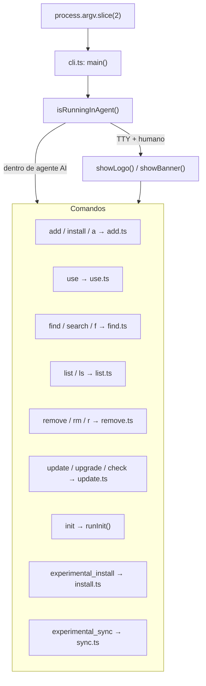
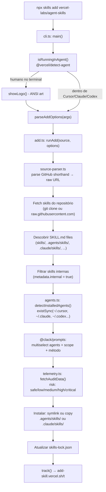
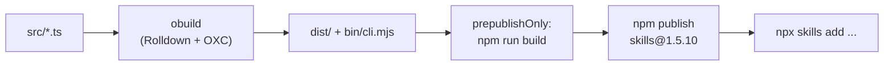

# vercel-labs/skills — Análise da CLI

Documentação de referência sobre o funcionamento da CLI [vercel-labs/skills](https://github.com/vercel-labs/skills), o ecossistema aberto de agent skills da Vercel Labs.

**Versão analisada:** 1.5.10  
**Repositório:** https://github.com/vercel-labs/skills  
**Instalação:** `npx skills add vercel-labs/agent-skills`

---

## 1. Estrutura de pastas

O repositório é um **pacote único** (não monorepo). Uma única `package.json` publicada no npm como `skills`. A única dependência de runtime é `yaml` (parse do frontmatter de `SKILL.md`).

```
vercel-labs/skills/
├── .github/
│   ├── ISSUE_TEMPLATE/
│   │   ├── agent-request.yml    ← template para solicitar suporte a novo agente
│   │   ├── bug-report.yml
│   │   ├── config.yml
│   │   └── feature-request.yml
│   ├── RELEASE_TEMPLATE.md      ← template de notas de release no GitHub
│   └── workflows/
│       ├── agents.yml           ← validação/sincronização do registry de agentes
│       ├── ci.yml               ← lint, type-check, test
│       └── publish.yml          ← release manual no npm (workflow_dispatch)
├── .husky/
│   └── pre-commit               ← lint-staged (prettier)
├── bin/
│   └── cli.mjs                  ← entry point publicado no npm (output do obuild)
├── scripts/
│   ├── execute-tests.ts         ← runner de testes de integração
│   ├── generate-licenses.ts     ← gera ThirdPartyNoticeText.txt no build
│   ├── sync-agents.ts           ← sincroniza agents.ts com fonte externa
│   └── validate-agents.ts       ← valida consistência do registry de agentes
├── skills/
│   └── find-skills/
│       └── SKILL.md             ← skill embutida no próprio repo (dogfooding)
├── src/                         ← código-fonte TypeScript
│   ├── cli.ts                   ← entry dev + roteador manual de argv
│   ├── add.ts                   ← comando principal (install)
│   ├── agents.ts                ← registry de 71 agentes + paths + detectInstalled
│   ├── blob.ts                  ← fetch de arquivos via GitHub/GitLab blob API
│   ├── constants.ts             ← constantes globais
│   ├── detect-agent.ts          ← detecta se roda dentro de um agente AI
│   ├── find.ts                  ← busca fzf-style (readline + ANSI)
│   ├── frontmatter.ts           ← parse YAML frontmatter de SKILL.md
│   ├── git.ts                   ← clone/fetch com simple-git
│   ├── install.ts               ← restore do skills-lock.json
│   ├── installer.ts             ← lógica de symlink/copy para diretórios de agentes
│   ├── list.ts                  ← lista skills instaladas
│   ├── local-lock.ts            ← leitura/escrita do skills-lock.json
│   ├── plugin-manifest.ts       ← discovery via .claude-plugin/marketplace.json
│   ├── remove.ts                ← remove skills instaladas
│   ├── sanitize.ts              ← sanitiza metadata de SKILL.md
│   ├── skill-lock.ts            ← lockfile por skill (versão, source, ref)
│   ├── skills.ts                ← discovery de SKILL.md no repositório
│   ├── source-parser.ts         ← parse owner/repo, URLs, git, local path
│   ├── sync.ts                  ← sync skills do node_modules
│   ├── telemetry.ts             ← telemetria anônima + audit API
│   ├── types.ts                 ← AgentType, AgentConfig, Skill, etc.
│   ├── update.ts                ← atualiza skills instaladas
│   ├── update-source.ts         ← resolve nova versão da source
│   ├── use.ts                   ← usa skill sem instalar (pipe para agente)
│   ├── prompts/
│   │   └── search-multiselect.ts← prompt multiselect customizado (clack-like)
│   └── providers/
│       ├── index.ts
│       ├── registry.ts          ← registry de providers (GitHub, HuggingFace, etc.)
│       ├── types.ts
│       └── wellknown.ts         ← providers well-known (mintlify, huggingface, etc.)
├── tests/                       ← testes de integração (fora de src/)
│   ├── blob-fetch-tree-auth.test.ts
│   ├── cross-platform-paths.test.ts
│   ├── dist.test.ts
│   ├── full-depth-discovery.test.ts
│   ├── installer-copy.test.ts
│   ├── installer-symlink.test.ts
│   ├── list-installed.test.ts
│   ├── local-lock.test.ts
│   ├── nested-container-discovery.test.ts
│   ├── openclaw-paths.test.ts
│   ├── plugin-grouping.test.ts
│   ├── plugin-manifest-discovery.test.ts
│   ├── remove-canonical.test.ts
│   ├── sanitize-name.test.ts
│   ├── sanitize-terminal.test.ts
│   ├── search-multiselect-visual-rows.test.ts
│   ├── skill-matching.test.ts
│   ├── skill-path.test.ts
│   ├── source-parser.test.ts
│   ├── subpath-traversal.test.ts
│   ├── sync.test.ts
│   ├── update.test.ts
│   ├── wellknown-provider.test.ts
│   └── xdg-config-paths.test.ts
├── build.config.mjs             ← config do obuild (Rolldown)
├── package.json                 ← bin: skills + add-skill → bin/cli.mjs
├── pnpm-lock.yaml
├── tsconfig.json
├── .prettierrc
├── .gitignore
├── AGENTS.md                    ← instruções para agentes AI contribuírem
├── README.md
└── ThirdPartyNoticeText.txt     ← licenças de terceiros (gerado no build)
```

### Tabela de responsabilidade dos módulos (`src/`)

| Módulo | Comando / Domínio | Responsabilidade |
|--------|-------------------|------------------|
| `cli.ts` | Todos | Entry point, roteamento manual de argv, banner/logo, help |
| `add.ts` | `add`, `install`, `a` | Fluxo principal de instalação de skills |
| `agents.ts` | `add`, `remove`, `list` | Registry de 71 agentes, paths, detecção de instalação |
| `blob.ts` | `add`, `use` | Fetch de arquivos via API blob (GitHub/GitLab) |
| `detect-agent.ts` | Todos | Detecta se CLI roda dentro de um agente AI |
| `find.ts` | `find`, `search`, `f` | Busca interativa fzf-style + API skills.sh |
| `frontmatter.ts` | `add`, `skills` | Parse YAML frontmatter de `SKILL.md` |
| `git.ts` | `add`, `update` | Clone e fetch de repositórios git |
| `install.ts` | `experimental_install` | Restore de skills a partir do `skills-lock.json` |
| `installer.ts` | `add`, `sync` | Symlink ou copy para diretórios de agentes |
| `list.ts` | `list`, `ls` | Lista skills instaladas (projeto e global) |
| `local-lock.ts` | `add`, `install` | Leitura/escrita do `skills-lock.json` |
| `plugin-manifest.ts` | `add` | Discovery via `.claude-plugin/marketplace.json` |
| `remove.ts` | `remove`, `rm`, `r` | Remove skills instaladas |
| `sanitize.ts` | `add`, `find` | Sanitiza metadata de skills |
| `skill-lock.ts` | `add`, `update` | Lockfile por skill (versão, source, ref) |
| `skills.ts` | `add`, `use` | Discovery de `SKILL.md` no repositório |
| `source-parser.ts` | `add`, `use` | Parse de fontes (owner/repo, URLs, git, local) |
| `sync.ts` | `experimental_sync` | Sincroniza skills do `node_modules` |
| `telemetry.ts` | Todos | Telemetria anônima + audit API de segurança |
| `types.ts` | Todos | Tipos compartilhados (`AgentType`, `AgentConfig`, etc.) |
| `update.ts` | `update`, `upgrade`, `check` | Atualiza skills instaladas |
| `update-source.ts` | `update` | Resolve nova versão da source |
| `use.ts` | `use` | Usa skill sem instalar (pipe para agente) |
| `prompts/search-multiselect.ts` | `add` | Prompt multiselect customizado |
| `providers/*` | `add`, `use` | Providers de skills (GitHub, HuggingFace, Mintlify, etc.) |

### Roteamento de comandos (`cli.ts`)



### O que vai para o npm

O campo `files` do `package.json` limita o pacote publicado a:

- `dist/` — bundle gerado pelo obuild
- `bin/` — `cli.mjs` (entry point)
- `README.md`
- `ThirdPartyNoticeText.txt` — licenças de terceiros (gerado no build)

Os binários registrados:

```json
"bin": {
  "skills": "./bin/cli.mjs",
  "add-skill": "./bin/cli.mjs"
}
```

---

## 2. Fluxo do comando `npx skills add`



### Passo a passo

1. **Entrada** — `npx skills add vercel-labs/agent-skills` executa `bin/cli.mjs`.
2. **Roteamento** — `cli.ts` identifica o comando `add` e delega para `add.ts`.
3. **Detecção de contexto** — `isRunningInAgent()` verifica se a CLI roda dentro de um agente AI (Cursor, Claude Code, Codex, etc.).
4. **Parse de opções** — `parseAddOptions()` processa flags (`-g`, `-a`, `-s`, `-y`, `--copy`, `--all`, etc.).
5. **Parse da fonte** — `source-parser.ts` converte `owner/repo` em URL raw do GitHub ou prepara clone git.
6. **Fetch de skills** — `blob.ts` ou `git.ts` busca os arquivos do repositório remoto.
7. **Discovery** — `skills.ts` encontra todos os `SKILL.md` em diretórios conhecidos (`skills/`, `.agents/skills/`, `.claude/skills/`, etc.).
8. **Filtro** — skills com `metadata.internal: true` são ocultadas (a menos que `INSTALL_INTERNAL_SKILLS=1`).
9. **Detecção de agentes** — `agents.ts` verifica quais dos 71 agentes estão instalados no sistema.
10. **Prompts interativos** — `@clack/prompts` solicita agentes, escopo (global/projeto) e método (symlink/copy), salvo em modo `-y` ou dentro de agente.
11. **Auditoria** — `fetchAuditData()` consulta risk score antes da instalação.
12. **Instalação** — `installer.ts` cria symlinks ou cópias nos diretórios corretos de cada agente.
13. **Lockfile** — `local-lock.ts` atualiza `skills-lock.json` com source, ref e skills instaladas.
14. **Telemetria** — `track()` envia evento anônimo para `add-skill.vercel.sh/t`.

---

## 3. Detecção de agentes instalados

O arquivo `agents.ts` mantém um registry de **71 agentes**. Para cada um, define:

- `skillsDir` — path relativo ao projeto
- `globalSkillsDir` — path global no home do usuário
- `detectInstalled()` — função que verifica se o agente está instalado

Exemplo:

```typescript
cursor: {
  skillsDir: '.agents/skills',
  globalSkillsDir: join(home, '.cursor/skills'),
  detectInstalled: async () => existsSync(join(home, '.cursor')),
},
'claude-code': {
  skillsDir: '.claude/skills',
  globalSkillsDir: join(claudeHome, 'skills'),
  detectInstalled: async () => existsSync(claudeHome),
},
```

### Dois grupos de agentes

| Grupo | `skillsDir` | Exemplos | Comportamento |
|-------|-------------|----------|---------------|
| **Universal** | `.agents/skills/` | Cursor, Codex, GitHub Copilot, Gemini CLI, Cline | Compartilham o mesmo diretório no projeto |
| **Não-universal** | path específico | Claude Code (`.claude/skills/`), Windsurf, OpenCode | Cada um tem diretório próprio |

Para agentes não-universais, a CLI cria **symlinks** do `.agents/skills/` (canonical) para os diretórios específicos — single source of truth.

Funções auxiliares em `agents.ts`:

- `getUniversalAgents()` — agentes que usam `.agents/skills/`
- `getNonUniversalAgents()` — agentes com diretório próprio
- `isUniversalAgent(type)` — verifica se um agente é universal

---

## 4. Detecção de contexto de agente

O módulo `detect-agent.ts` usa `@vercel/detect-agent` para saber se a CLI está sendo executada **dentro** de um agente AI.

Quando `isRunningInAgent()` retorna `true`:

- Pula logos, banners e prompts interativos
- Usa defaults automáticos (agente detectado, escopo inferido)
- Comportamento não-interativo (CI-friendly e agent-friendly)

Mapeamento de nomes detectados para `AgentType`:

```typescript
const agentNameToType = {
  cursor: 'cursor',
  'cursor-cli': 'cursor',
  claude: 'claude-code',
  codex: 'codex',
  gemini: 'gemini-cli',
  opencode: 'opencode',
  'github-copilot': 'github-copilot',
  // ...
};
```

---

## 5. Fontes suportadas

| Formato | Exemplo | Resolução |
|---------|---------|-----------|
| GitHub shorthand | `vercel-labs/agent-skills` | `raw.githubusercontent.com` |
| URL GitHub | `https://github.com/vercel-labs/agent-skills` | GitHub raw API |
| Path direto | `.../tree/main/skills/web-design-guidelines` | Subpath do repo |
| GitLab | `https://gitlab.com/org/repo` | GitLab raw API |
| Git URL | `git@github.com:vercel-labs/agent-skills.git` | Clone via `simple-git` |
| Local | `./my-local-skills` | Filesystem local |

Providers adicionais em `src/providers/wellknown.ts` suportam fontes como Mintlify, HuggingFace e outros hosts well-known.

---

## 6. Busca interativa (`find.ts`)

O prompt fzf-style é implementado **sem Ink e sem React**:

- `readline` do Node.js para eventos de keypress
- ANSI escape codes escritos direto no `process.stdout`
- API `https://skills.sh/api/search?q=...` para resultados
- Debounce adaptativo por comprimento de query (2 chars: 250ms, 5+ chars: 150ms)

Em modo não-interativo (TTY ausente ou dentro de agente), exibe dicas de uso em vez do prompt fzf.

---

## 7. Segurança e telemetria

### Auditoria de segurança

Antes de instalar, `fetchAuditData()` consulta:

```
GET https://add-skill.vercel.sh/audit?source=...&skills=...
```

Retorna risk score por skill: `safe`, `low`, `medium`, `high`, `critical`, `unknown`. Timeout de 3s — nunca bloqueia a instalação em caso de falha.

### Telemetria anônima

Eventos rastreados: `install`, `remove`, `update`, `find`, `experimental_sync`.

Endpoint: `https://add-skill.vercel.sh/t`

Desabilitada quando:

- Variável `DISABLE_TELEMETRY` ou `DO_NOT_TRACK` está definida
- Ambiente CI detectado (`CI`, `GITHUB_ACTIONS`, `GITLAB_CI`, etc.)

### Variáveis de ambiente

| Variável | Descrição |
|----------|-----------|
| `INSTALL_INTERNAL_SKILLS` | `1` ou `true` para mostrar skills com `metadata.internal: true` |
| `DISABLE_TELEMETRY` | Desabilita telemetria |
| `DO_NOT_TRACK` | Alternativa para desabilitar telemetria |
| `SKILLS_API_URL` | URL base da API de busca (default: `https://skills.sh`) |
| `CODEX_HOME` | Override do diretório home do Codex |
| `CLAUDE_CONFIG_DIR` | Override do diretório home do Claude Code |

---

## 8. Build e distribuição



### Build (`obuild`)

- **Bundler**: `obuild` (unjs) — zero-config, baseado em Rolldown (Rust) + OXC
- **Config**: `build.config.mjs`
- **Scripts**:
  - `build` — `node scripts/generate-licenses.ts && obuild`
  - `dev` — `node src/cli.ts` (execução direta do TypeScript)
  - `prepublishOnly` — `npm run build` (build automático antes de publicar)

### Publicação npm

- `npm publish --provenance --access public`
- Snapshot releases: `publish:snapshot` cria versões `prerelease` com tag `snapshot`
- Dois binários: `skills` e `add-skill` (alias legado)

### CI/CD (GitHub Actions)

| Workflow | Trigger | Função |
|----------|---------|--------|
| `ci.yml` | push/PR | Lint, type-check, test |
| `agents.yml` | push/PR | Validação do registry de agentes |
| `publish.yml` | `workflow_dispatch` | Bump version (patch/minor), GPG sign, npm publish, GitHub Release |

O workflow `publish.yml`:

1. Checkout + install
2. Build (`pnpm build`)
3. Import GPG signing key
4. `npm version patch|minor`
5. Push tags
6. `npm publish --provenance --access public`
7. Cria GitHub Release com changelog de PRs mergeados

---

## 9. Comandos disponíveis

| Comando | Aliases | Descrição |
|---------|---------|-----------|
| `add` | `install`, `a`, `i` | Instalar skills de um repositório |
| `use` | — | Usar skill sem instalar (pipe para agente) |
| `find` | `search`, `f`, `s` | Buscar skills (fzf ou keyword) |
| `list` | `ls` | Listar skills instaladas |
| `remove` | `rm`, `r` | Remover skills instaladas |
| `update` | `upgrade`, `check` | Atualizar skills instaladas |
| `init` | — | Criar template `SKILL.md` |
| `experimental_install` | — | Restore do `skills-lock.json` |
| `experimental_sync` | — | Sync skills do `node_modules` |

---

## 10. Decisões arquiteturais notáveis

1. **Sem framework CLI** — routing manual com `switch` em `cli.ts` (sem Commander, yargs, oclif)
2. **Clack apenas para prompts** — `@clack/prompts` como devDependency, bundled no build
3. **1 runtime dependency** — apenas `yaml`; tudo mais é devDependency ou bundled
4. **Symlink como default** — single source of truth em `.agents/skills/`
5. **Lockfile** — `skills-lock.json` para reprodutibilidade em equipe
6. **71 agentes** — registry extensível com validação automatizada via `scripts/validate-agents.ts`

---

## Links relacionados

- [Agent Skills Specification](https://agentskills.io)
- [Skills Directory](https://skills.sh)
- [Vercel Agent Skills Repository](https://github.com/vercel-labs/agent-skills)
